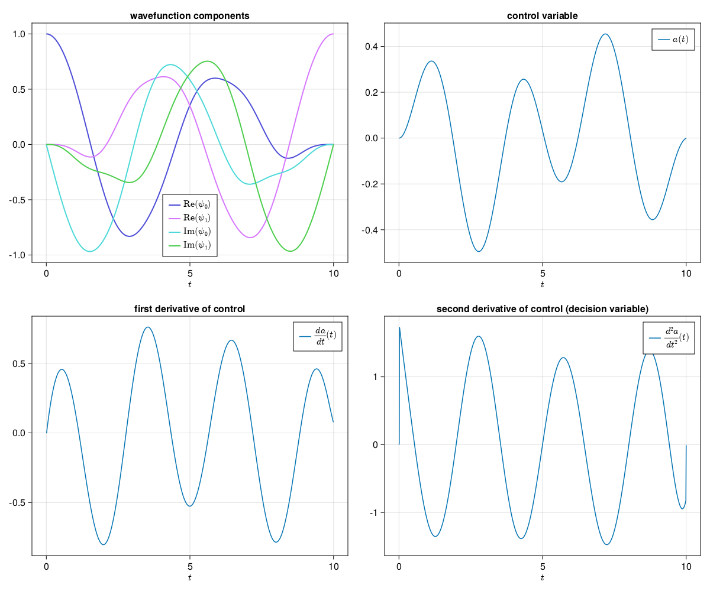

# QuantumControl.jl

this package aims to provide an interface between the python package QuTiP and the Altro.jl trajectory optimization package.

the goal is to do multi-qubit quantum optimal control quickly and robustly. 

## installation

to use this package, clone it, and then, from a julia REPL in the cloned directory run

`(@v1.7) pkg> activate .`

`(QuantumControl) pkg> instantiate`

one should have a python environment containing scipy and qutip (this can be achieved with conda, by activating the environment before running the julia scripts.

## usage

right now, all that is implemented is 

* functions to load saved qutip objects into julia
* a `RobotDynamics.ContinuousDynamics` subtype model for a multi-qubit system
* dynamics functions for this model which convert complex objects to isomporphic real objects

## quantum optimal control

in the future this section will discuss the theory of QOC. for now I will just demonstrate the new ability to render $\LaTeX$ in github markdown.

$$
i \hbar \partial_t \ket{\psi} = \hat H \ket{\psi}
$$

## example: single fluxonium qubit

The above plot shows the dynamics for the wavefunction and control $a(t)$ s.t. 

$$
\ket{0} \to X \ket{0} = \ket{1}
$$

## TODO:

- [ ] multistate single qubit script
- [ ] scripts for X, Y, Z gates
- [ ] add functionality to define wavefunctions as complex vectors 
- [ ] add plotting utilities
  - [x] multistate
  - [ ] multigate
  - [ ] block sphere path (single qubit case)
- [ ] two qubit problem
- [ ] README
  - [ ] expand usage section
  - [ ] theory section
 
