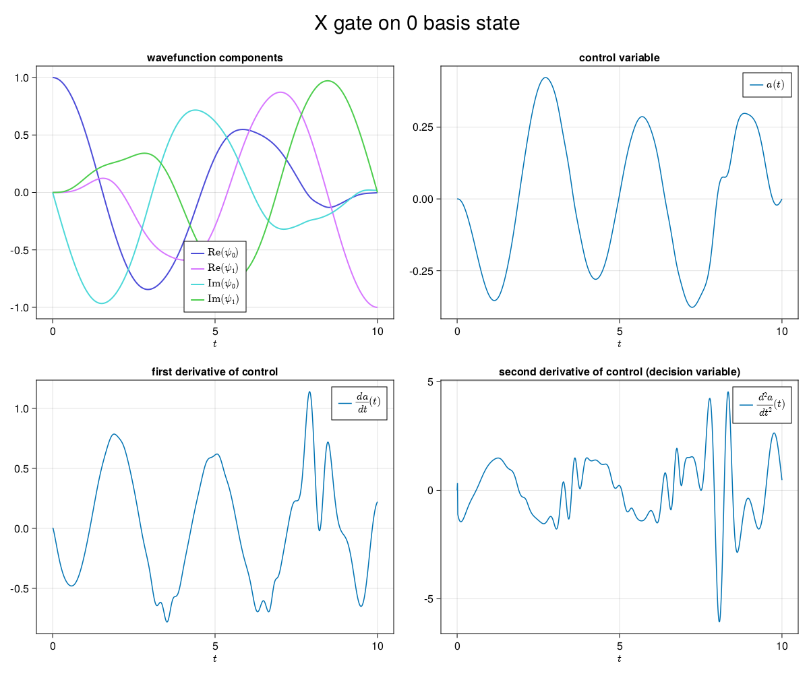

# QuantumControl.jl

> HEADS UP: this repo was experimental and functionality will be moved to my new repo: QubitControl.jl

this package aims to provide an interface between the python package QuTiP and the Altro.jl trajectory optimization package.

the goal is to do multi-qubit quantum optimal control quickly and robustly. 

## installation

to use this package, clone it, and then, from a julia REPL in the cloned directory run

`(@v1.7) pkg> activate .`

`(QuantumControl) pkg> instantiate`

one should have a python environment containing scipy and qutip (this can be achieved with conda, by activating the environment before running the julia scripts.

## usage

see `experiments` directory for examples including:

* single qubit gates with a single quantum state
* single qubit gates with multiple quantum states
* bootstrapped single qubit, multi-state solves

## quantum optimal control

this problem involves taking advantage of an experimental time-dependent qubit Hamiltonian that has a controllable parameter, e.g. 

$$
\begin{equation}
H(t, a(t)) = f_q {\sigma_z \over 2} + a(t) {\sigma_x \over 2}  
\end{equation}
$$

which governs the dynamics of a qubit state via the Schroedinger equation:

$$
\begin{equation}
{d \over dt} \ket{\psi} = -iH(t, a(t)) \ket{\psi}
\end{equation}
$$

The goal is then to find $a(t)$ s.t. $\ket{\psi(t_0)} \to \ket{\psi(t_f)} = X\ket{\psi(t_0)}$ with the dynamics satisfying (1) and (2).   

## example: single fluxonium qubit

The above plot shows the dynamics for the wavefunction and control $a(t)$ s.t. 

$$
\ket{0} \to X \ket{0} = \ket{1}
$$

## TODO:

- [x] multistate single qubit script
- [x] scripts for X, Y, Z gates
- [x] add functionality to define wavefunctions as complex vectors 
- [x] add plotting utilities
- [ ] two qubit problem
 
